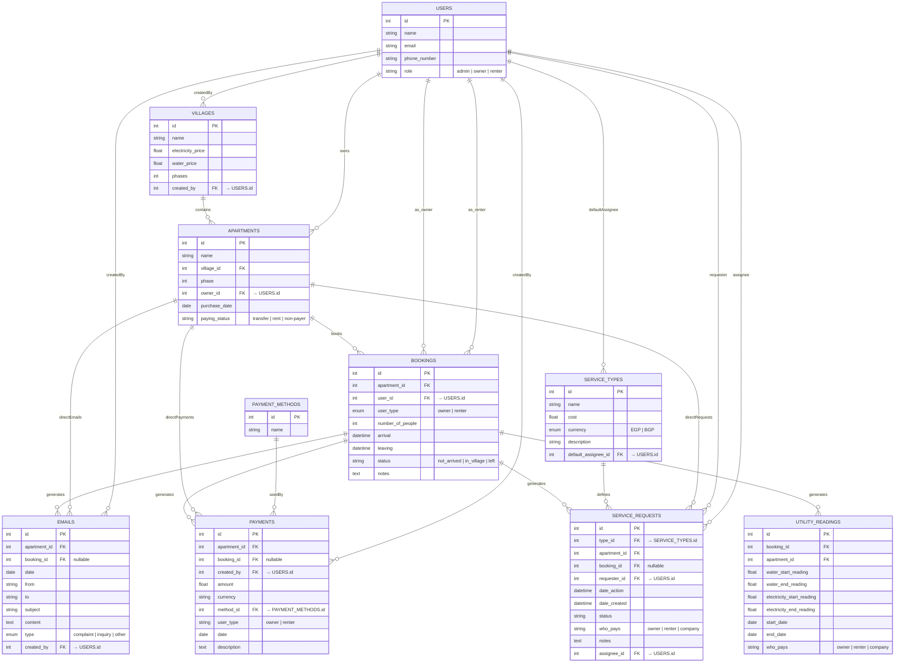

# Entity Relationship Diagram

```mermaid
erDiagram
    VILLAGES {
        int    id PK
        string name
        float  electricity_price
        float  water_price
        int    phases
        int    created_by FK "→ USERS.id"
    }
    USERS {
        int    id PK
        string name
        string email
        string phone_number
        string role       "admin | owner | renter"
    }
    APARTMENTS {
        int    id PK
        string name
        int    village_id FK
        int    phase
        int    owner_id   FK "→ USERS.id"
        date   purchase_date
        string paying_status    "transfer | rent | non-payer"
    }
    BOOKINGS {
        int    id PK
        int    apartment_id FK
        int    user_id      FK "→ USERS.id"
        enum   user_type     "owner | renter"
        int    number_of_people
        datetime arrival
        datetime leaving
        string status        "not_arrived | in_village | left"
        text   notes
    }
    SERVICE_TYPES {
        int    id PK
        string name
        float  cost
        enum currency   "EGP | BGP"
        string description
        int    default_assignee_id FK "→ USERS.id"
    }
    SERVICE_REQUESTS {
        int    id PK
        int    type_id       FK "→ SERVICE_TYPES.id"
        int    apartment_id  FK
        int    booking_id    FK "nullable"
        int    requester_id  FK "→ USERS.id"
        datetime date_action
        datetime date_created
        string status
        string who_pays      "owner | renter | company"
        text   notes
        int    assignee_id   FK "→ USERS.id"
    }
    UTILITY_READINGS {
        int    id PK
        int    booking_id    FK
        int    apartment_id  FK
        float water_start_reading
        float water_end_reading
        float electricity_start_reading
        float electricity_end_reading
        date   start_date
        date   end_date
        string who_pays      "owner | renter | company"
    }
    PAYMENT_METHODS {
        int    id PK
        string name
    }
    PAYMENTS {
        int    id PK
        int    apartment_id  FK
        int    booking_id    FK "nullable"
        int    created_by    FK "→ USERS.id"
        float  amount
        string currency
        int    method_id     FK "→ PAYMENT_METHODS.id"
        string user_type     "owner | renter"
        date   date
        text   description
    }
    EMAILS {
        int    id PK
        int    apartment_id  FK
        int    booking_id    FK "nullable"
        date   date
        string from
        string to
        string subject
        text   content
        enum type          "complaint | inquiry | other"
        int    created_by    FK "→ USERS.id"
    }

    %% relationships
    VILLAGES ||--o{ APARTMENTS        : contains
    USERS    ||--o{ APARTMENTS        : owns
    APARTMENTS ||--o{ BOOKINGS         : books
    USERS    ||--o{ BOOKINGS         : as_owner
    USERS    ||--o{ BOOKINGS         : as_renter
    BOOKINGS ||--o{ UTILITY_READINGS  : generates
    BOOKINGS ||--o{ PAYMENTS          : generates
    BOOKINGS ||--o{ SERVICE_REQUESTS  : generates
    BOOKINGS ||--o{ EMAILS            : generates
    SERVICE_TYPES ||--o{ SERVICE_REQUESTS : defines
    APARTMENTS ||--o{ PAYMENTS         : directPayments
    APARTMENTS ||--o{ SERVICE_REQUESTS : directRequests
    APARTMENTS ||--o{ EMAILS           : directEmails
    PAYMENT_METHODS ||--o{ PAYMENTS     : usedBy
    
    %% Missing foreign key relationships
    USERS    ||--o{ VILLAGES          : createdBy
    USERS    ||--o{ SERVICE_TYPES     : defaultAssignee
    USERS    ||--o{ SERVICE_REQUESTS  : requester
    USERS    ||--o{ SERVICE_REQUESTS  : assignee
    USERS    ||--o{ PAYMENTS          : createdBy
    USERS    ||--o{ EMAILS            : createdBy

```